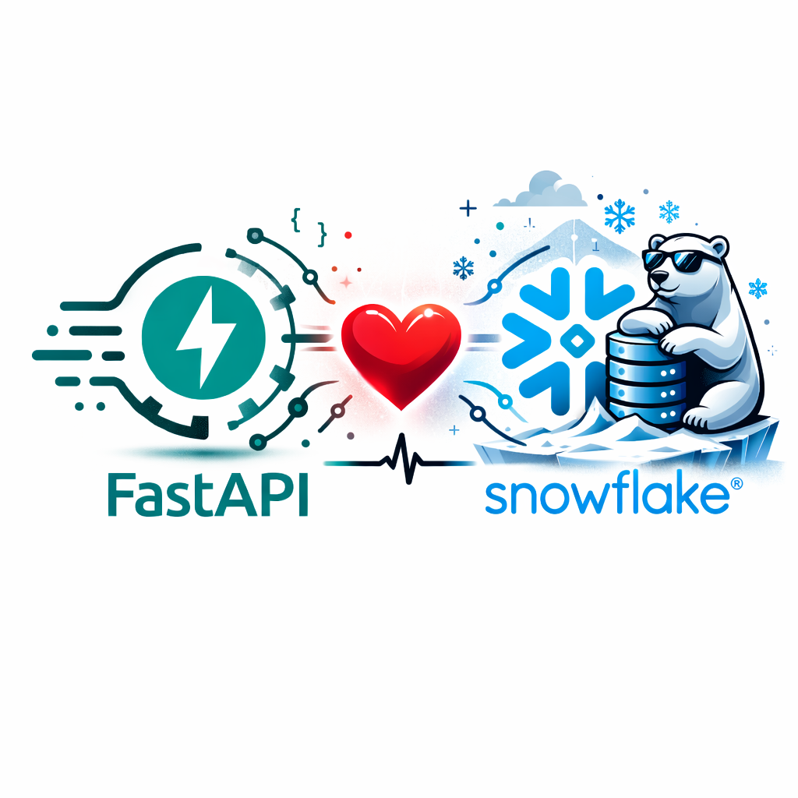

<p align="center">
  <a href="https://github.com/MiguelElGallo/FastAPI-in-Snowflake">
    
  </a>
</p>
<p align="center">
  <em>A FastAPI app running inside Snowflake Container Services — fully declarative, no Terraform required.</em>
</p>
<p align="center">
  <a href="https://github.com/MiguelElGallo/FastAPI-in-Snowflake/actions/workflows/deploy.yml">
    
  </a>
  <a href="https://github.com/MiguelElGallo/FastAPI-in-Snowflake/blob/main/LICENSE">
    
  </a>
</p>

---

## Key Features

- **Fully declarative** — infrastructure defined in `snowflake.yml` and `spec.yml`, deployed with the `snow` CLI
- **Zero external dependencies** — no Terraform, no external Docker registry, no separate database server
- **JWT authentication** — built-in user management with role-based access control
- **OAuth token auth** — automatic token injection via SPCS; no Snowflake credentials stored in the container
- **CI/CD ready** — GitHub Actions workflows for one-click setup and continuous deployment
- **Self-hosted docs** — Swagger UI assets bundled in the image (SPCS ingress CSP blocks external CDNs)

> **Warning:** Most enterprise Snowflake accounts use **private endpoints** (e.g. AWS PrivateLink, Azure Private Link). If your account uses private connectivity, you may need to adjust network rules, DNS configuration, and service endpoint settings. See the [Snowflake private connectivity documentation](https://docs.snowflake.com/en/user-guide/private-connectivity) for details.

## How It Works

```text
GitHub Actions ──push image──▶  Snowflake Image Registry
       │                              │
       │  snow spcs service create    ▼
       └──────────────────────▶  SPCS Service (FastAPI + Uvicorn)
                                      │  OAuth token auto-injected
                                      ▼
                               Snowflake Tables
```

1. You push to `main`.
2. GitHub Actions builds your Docker image and pushes it to the **Snowflake Image Registry**.
3. The workflow creates (or upgrades) an **SPCS service** running your FastAPI app.
4. Inside the container, Snowflake injects an OAuth token — the app uses it to query your tables directly.

## Tech Stack

| Layer | Technology |
|-------|-----------|
| **API Framework** | FastAPI + Uvicorn |
| **Database** | Snowflake standard tables (via `snowflake-connector-python`) |
| **API Auth** | JWT (python-jose) + bcrypt (passlib) |
| **Container Runtime** | Snowflake Container Services (SPCS) |
| **Infrastructure** | Snowflake CLI (`snow`) — declarative |
| **CI/CD** | GitHub Actions |

## Project Layout

```text
├── .github/workflows/
│   ├── setup-infra.yml     # One-time: DB, tables, compute pool, image repo
│   └── deploy.yml          # On push: build, push image, deploy service
├── app/
│   ├── main.py             # FastAPI app factory + self-hosted docs
│   ├── config.py           # Pydantic Settings (env-driven)
│   ├── database.py         # Snowflake connector wrapper (OAuth / password)
│   ├── security.py         # JWT creation + password hashing
│   ├── dependencies.py     # DI: get_current_user, get_current_superuser
│   ├── models/             # Pydantic request/response schemas
│   ├── crud/               # Raw-SQL database operations
│   └── routers/            # API endpoint handlers
├── snowflake.yml           # SPCS project definition
├── spec.yml                # SPCS service specification (env vars, probes)
├── setup.sql               # One-time Snowflake DDL
├── Dockerfile              # Multi-stage build (app + static assets)
└── requirements.txt
```

## What You'll Need

1. **Python 3.10+** — the app uses modern type hints; the Docker image pins 3.12
2. **Snowflake account** with Container Services enabled
3. **Snowflake CLI** (`snow`) installed locally — [install guide](https://docs.snowflake.com/en/developer-guide/snowflake-cli/installation/installation)
4. **RSA key pair** for CI/CD authentication — [key pair guide](https://docs.snowflake.com/en/user-guide/key-pair-auth)

> **Tip:** Verify your CLI is working with `snow --version`. You need v3+.

## Get Started Locally

> **Info:** The `.env` file is only used for local development. When deployed to SPCS, configuration comes from `spec.yml` environment variables and SPCS-injected values.

```bash
# 1. Clone the repo
git clone https://github.com/MiguelElGallo/FastAPI-in-Snowflake.git
cd FastAPI-in-Snowflake

# 2. Configure your environment
cp .env.example .env
# Edit .env — at minimum, set SNOWFLAKE_ACCOUNT, SNOWFLAKE_USER, SNOWFLAKE_PASSWORD

# 3. Run the setup SQL in Snowflake (once)
snow sql -f setup.sql --connection your_connection --role ACCOUNTADMIN

# 4. Install dependencies
python -m venv .venv && source .venv/bin/activate
pip install -r requirements.txt

# 5. Start the dev server
uvicorn app.main:app --reload --port 8000
```

Open **http://localhost:8000/api/v1/docs** for the interactive API docs.

> **Note:** The Swagger UI assets (`swagger-ui-bundle.js`, `swagger-ui.css`) are downloaded during the Docker build and don't exist in the repo. When running locally without Docker, the docs page won't render the UI. To fix this, create a `static/` directory and download the files:
> ```bash
> mkdir -p static
> curl -sL -o static/swagger-ui-bundle.js "https://cdn.jsdelivr.net/npm/swagger-ui-dist@5/swagger-ui-bundle.js"
> curl -sL -o static/swagger-ui.css "https://cdn.jsdelivr.net/npm/swagger-ui-dist@5/swagger-ui.css"
> curl -sL -o static/redoc.standalone.js "https://cdn.jsdelivr.net/npm/redoc@next/bundles/redoc.standalone.js"
> ```

## 🚀 Deploy to Snowflake

### Step 1 — Configure GitHub Secrets

| Secret | Value |
|--------|-------|
| `SNOWFLAKE_ACCOUNT` | Your `org-account` identifier |
| `SNOWFLAKE_USER` | Service account username |
| `SNOWFLAKE_PRIVATE_KEY` | RSA private key (base64-encoded PEM) |
| `SNOWFLAKE_DATABASE` | `fastapi_db` (as created by `setup.sql`) |
| `SNOWFLAKE_SCHEMA` | `fastapi_schema` (as created by `setup.sql`) |
| `SNOWFLAKE_WAREHOUSE` | `fastapi_wh` (as created by `setup.sql`) |
| `SNOWFLAKE_ROLE` | `fastapi_role` (as created by `setup.sql`) |

You'll need to base64-encode your private key:

```bash
# macOS
base64 -i ~/.snowflake/rsa_key.p8 | tr -d '\n'

# Linux
cat ~/.snowflake/rsa_key.p8 | base64 | tr -d '\n'
```

> **Warning:** Never commit your RSA private key to the repository. Use GitHub Secrets for all sensitive values.

### Step 2 — Run Infrastructure Setup (once)

Go to **Actions → Setup SPCS Infrastructure → Run workflow**.

This will create your **database**, schema, warehouse, tables, image repository, and compute pool.

> **Important:** Make sure `fastapi_role` is granted to your CI/CD user. In `setup.sql`, uncomment and update the line:
> ```sql
> GRANT ROLE fastapi_role TO USER your_username;
> ```

### Step 3 — Deploy (automatic)

Just push to `main` — GitHub Actions will build your image, push it to the Snowflake registry, and deploy the service for you. Check the **Actions** tab to monitor progress.

> **Note:** The first deployment may take **5–10 minutes** while the compute pool provisions. Subsequent deploys are much faster.

### Step 4 — Find Your Service URL

Once deployed, find your public endpoint:

```bash
snow spcs service list-endpoints fastapi_service \
  --database fastapi_db \
  --schema fastapi_schema
```

This returns a table with your `ingress_url`:

```text
| name    | port | protocol | is_public | ingress_url                                      |
|---------+------+----------+-----------+--------------------------------------------------|
| fastapi | 8000 | HTTP     | true      | <hash>-<org>-<account>.snowflakecomputing.app    |
```

Your key URLs:

- **Swagger docs:** `https://<ingress_url>/api/v1/docs`
- **ReDoc:** `https://<ingress_url>/api/v1/redoc`
- **Health check:** `https://<ingress_url>/api/v1/health`

> **Note:** SPCS public endpoints require **Snowflake authentication**. When you visit the URL, you'll be prompted to log in with your Snowflake credentials (SSO).

You can check service status at any time:

```bash
snow spcs service status fastapi_service \
  --database fastapi_db \
  --schema fastapi_schema
```

### Step 5 — Log in to the API

After authenticating with Snowflake SSO, open the Swagger docs at `/api/v1/docs` and click the **Authorize** button.

Use the default superuser credentials (created automatically on first startup):

| Field | Value |
|-------|-------|
| **username** | `admin@example.com` |
| **password** | `changethis` |

> **Warning:** These are **default credentials** for development only. Change `JWT_SECRET_KEY`, `FIRST_SUPERUSER`, and `FIRST_SUPERUSER_PASSWORD` in `spec.yml` before deploying to production.

You can also obtain a token programmatically:

```bash
curl -X POST "https://<ingress_url>/api/v1/auth/login" \
  -H "Content-Type: application/x-www-form-urlencoded" \
  -d "username=admin@example.com&password=changethis"
```

## 📋 API Reference

| Method | Path | Description | Auth |
|--------|------|-------------|------|
| `POST` | `/api/v1/auth/login` | Get JWT token | Public |
| `GET` | `/api/v1/users/me` | Current user profile | Bearer |
| `PATCH` | `/api/v1/users/me` | Update your profile | Bearer |
| `GET` | `/api/v1/users/` | List all users | Superuser |
| `POST` | `/api/v1/users/` | Create a user | Superuser |
| `GET` | `/api/v1/users/{user_id}` | Get user by ID | Superuser |
| `DELETE`| `/api/v1/users/{user_id}` | Delete a user | Superuser |
| `GET` | `/api/v1/items/` | List your items | Bearer |
| `POST` | `/api/v1/items/` | Create an item | Bearer |
| `GET` | `/api/v1/items/{item_id}` | Get item by ID | Bearer |
| `PATCH` | `/api/v1/items/{item_id}` | Update an item | Bearer |
| `DELETE`| `/api/v1/items/{item_id}` | Delete an item | Bearer |
| `GET` | `/api/v1/health` | Health check | Public |

## 🔒 How Authentication Works in SPCS

There are **two layers** of authentication in this project:

1. **Snowflake → Container (OAuth):** When SPCS starts your container, it mounts an OAuth token at `/snowflake/session/token`. The app reads this token and uses it to connect to Snowflake — no passwords or secrets needed for the database connection. This is configured by `SNOWFLAKE_AUTH_TYPE: oauth` in `spec.yml`.

2. **User → API (JWT):** API consumers authenticate via `POST /api/v1/auth/login` with email + password, receiving a JWT bearer token. This token must be included in the `Authorization` header for protected endpoints.

> **Note:** No Snowflake credentials are stored in the container. The OAuth token is mounted and refreshed automatically by SPCS.

## ✨ Based on the FastAPI Full-Stack Template

This project is a simplified, Snowflake-native adaptation of the official [**FastAPI full-stack template**](https://github.com/fastapi/full-stack-fastapi-template) ([docs](https://fastapi.tiangolo.com/project-generation/)).

**What changed:**

- **Database** — PostgreSQL replaced with **Snowflake tables** (queried via `snowflake-connector-python`)
- **Migrations** — Alembic replaced with a single **`setup.sql`** DDL script
- **Deployment** — Docker Compose + Traefik replaced with **Snowflake Container Services**
- **Removed** — email recovery, Pytest, Celery, and the React frontend were stripped out to focus on the API + SPCS deployment

> **Tip:** If you need a full-stack setup with a frontend and background workers, start from the [original template](https://github.com/fastapi/full-stack-fastapi-template) instead.

## License

This project is licensed under the terms of the MIT license.
